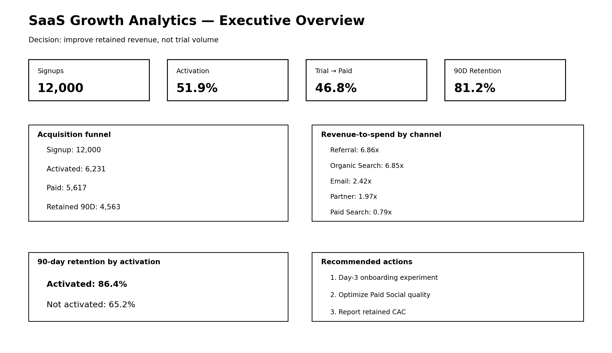
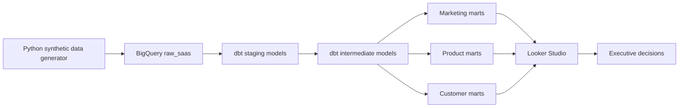

# SaaS Growth Analytics: From Acquisition to 90-Day Retention

> An end-to-end analytics engineering and decision-support case study built with **SQL, dbt, BigQuery, Python, and Looker Studio**.

[](#data-quality-and-testing)
[](data/data_dictionary.md)
[](#)

## Executive question

**Which acquisition channels bring customers who activate, convert, and remain subscribed—and where should Marketing and Product invest next?**

This project simulates the work of a senior marketing or customer analytics professional supporting a B2B SaaS growth team. It combines acquisition spend, multi-touch marketing journeys, onboarding behavior, subscriptions, invoices, and support interactions into a trusted analytics layer.

## Executive answer

The analysis indicates that **customer quality, not signup volume, should drive budget and onboarding decisions**:

1. **Activation is the strongest early growth lever.** Paid accounts that activated retained for 90 days at **86.4%**, versus **65.2%** among non-activated paid accounts. Activated trials also converted at **68.2%**, compared with **23.7%** for non-activated trials.
2. **Referral produces the strongest customer economics.** It generated a **52.8% activation rate**, **47.8% trial-to-paid conversion**, and **6.86x observed revenue-to-spend ratio** in the synthetic observation window.
3. **Paid Social drives scale but weaker downstream quality.** Its activation rate was **50.8%** and its observed revenue-to-spend ratio was **0.40x**, making it the clearest optimization opportunity among paid channels.
4. **Product onboarding and marketing efficiency are connected.** A scenario that raises Paid Social activation by 10 percentage points is estimated to produce approximately **81 additional 90-day retained paid accounts** and **$95,945 in annualized recurring revenue**. This is a planning scenario based on observed differences, not a causal forecast.

## Recommended decisions

| Priority | Recommendation | Expected business effect | How to validate |
|---|---|---|---|
| 1 | Trigger role-based onboarding when a trial has not completed two critical actions by day 3. | Increase activation, trial conversion, and 90-day retention. | Randomized holdout; primary metric: activation within 14 days; guardrails: unsubscribe rate and support volume. |
| 2 | Reallocate a controlled portion of Paid Social prospecting spend toward Referral and high-intent Paid Search. | Improve acquired-customer quality and revenue efficiency without stopping experimentation. | Geo or audience holdout; compare incremental paid conversions and 90-day gross profit. |
| 3 | Make `invited_teammate` and `connected_integration` explicit onboarding milestones. | Shorten time-to-value and create stickier multi-user workflows. | Funnel experiment with milestone prompts; measure 30- and 90-day retention. |
| 4 | Adopt retained CAC and 90-day revenue-to-spend alongside platform ROAS. | Prevent overinvestment in campaigns that generate low-quality signups. | Monthly metric reconciliation across warehouse, CRM, and ad platforms. |

## Dashboard preview



The live Looker Studio dashboard should contain four pages:

1. **Executive Overview** — signups, activation, trial conversion, 90-day retention, recurring revenue, and recommended action.
2. **Acquisition & Unit Economics** — spend, CAC, retained CAC, revenue-to-spend, and channel quality.
3. **Activation Funnel** — onboarding milestone completion, time-to-activation, and drop-off by segment.
4. **Retention & Customer Health** — cohort retention, churn signals, support burden, and intervention lists.

## Case structure

### Situation

The company is growing trial registrations across seven acquisition channels, but channel dashboards disagree and optimize toward top-of-funnel conversion. Leadership cannot tell whether high-volume campaigns create durable subscription revenue.

### Complication

Marketing data is separated from product events, billing, and support data. Platform ROAS therefore rewards immediate conversions without considering onboarding success, retention, or customer lifetime value.

### Question

Where should the company invest to acquire and retain more valuable customers, and which early product behaviors should be influenced?

### Answer

Build a governed customer-level model, connect spend to lifecycle outcomes, identify activation milestones, and measure channel performance using retained customers and realized revenue—not signups alone.

## Metric definitions

| Metric | Definition |
|---|---|
| Activation | Account completes at least two of three critical actions—create a project, invite a teammate, connect an integration—within 14 days of signup. |
| Trial-to-paid conversion | Share of trial accounts with a non-null conversion date. |
| 90-day retention | Paid account has no cancellation on or before 90 days after conversion. |
| CAC | Channel spend divided by new paid accounts attributed to that channel. |
| Retained CAC | Channel spend divided by paid accounts retained at day 90. |
| Revenue-to-spend | Realized invoice revenue divided by channel spend during the synthetic observation period ending March 31, 2026. |
| Customer health | Composite of activation, recent usage, support burden, and subscription status. |

## Architecture



## Repository map

```text
.
├── assets/                      # Portfolio images and dashboard wireframe
├── data/
│   ├── raw/                     # Reproducible synthetic source tables
│   ├── sample/                  # Small samples for quick inspection
│   └── data_dictionary.md
├── dbt/
│   ├── models/staging/          # Renaming, typing, source cleanup
│   ├── models/intermediate/     # Activation, attribution, revenue, retention
│   └── models/marts/            # Decision-ready marketing/product/customer tables
├── docs/
│   ├── executive_brief.md
│   ├── dashboard_build_guide.md
│   └── measurement_plan.md
├── scripts/
│   ├── generate_synthetic_data.py
│   └── load_csv_to_bigquery.py
├── sql/
│   ├── analysis/                # Hiring-manager-friendly business analyses
│   └── quality_checks/          # Reconciliation and QA queries
└── .github/workflows/           # Automated SQL/dbt checks
```

## Run the project

### 1. Generate the data

```bash
python -m venv .venv
# Windows: .venv\Scripts\activate
# macOS/Linux: source .venv/bin/activate
pip install -r requirements.txt
python scripts/generate_synthetic_data.py
```

### 2. Load raw CSV files to BigQuery

Create a Google Cloud project and a BigQuery dataset named `raw_saas`, authenticate locally, then run:

```bash
python scripts/load_csv_to_bigquery.py --project YOUR_GCP_PROJECT --dataset raw_saas
```

### 3. Configure and run dbt

```bash
cd dbt
cp profiles.example.yml ~/.dbt/profiles.yml
# Replace YOUR_GCP_PROJECT and authentication values in profiles.yml
dbt debug
dbt build
```

### 4. Connect Looker Studio

Connect each dashboard page to the relevant mart in the `analytics_saas` dataset. Follow [docs/dashboard_build_guide.md](docs/dashboard_build_guide.md), then replace the dashboard placeholder in this README with your public report link and screenshots.

## Data quality and testing

The dbt project tests:

- Primary-key uniqueness and non-nullness
- Valid channel, event, plan, and status values
- Account relationships across event, subscription, invoice, and support tables
- One row per account in customer marts
- Logical dates, including conversion after signup and cancellation after conversion
- Reconciliation between invoice revenue and channel revenue marts

Run all models and tests with:

```bash
dbt build
```

## Limitations

- Data is synthetic and designed to demonstrate analytical reasoning, not reproduce a real company.
- Revenue-to-spend is observational and should not be interpreted as causal incrementality.
- First-touch attribution simplifies multi-touch journeys; the repository includes a multi-touch comparison query for transparency.
- The annualized scenario assumes observed activation differences would partially transfer under intervention. A randomized experiment is required before financial commitment.

## What this project demonstrates

- Advanced SQL and dimensional modelling
- dbt transformations, documentation, tests, and lineage
- Marketing funnel, attribution, CAC, retention, and LTV analysis
- Product activation and customer-health analytics
- Experiment design and quantified recommendations
- Executive communication that separates evidence, assumptions, and decisions

## Author

**[Miaad Nabizadeh]** — Marketing Analytics | Customer Insights | Product Analytics  
[LinkedIn]([YOUR_LINKEDIN_URL](https://www.linkedin.com/in/miaadnabizadeh/))
