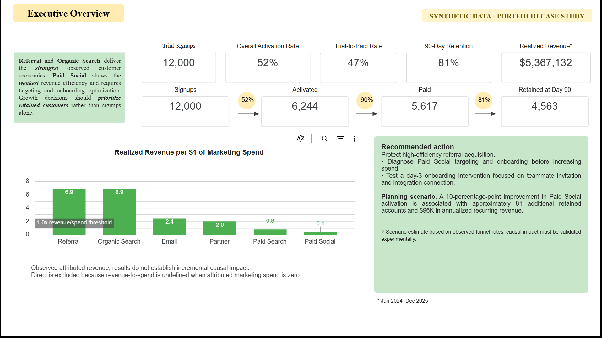
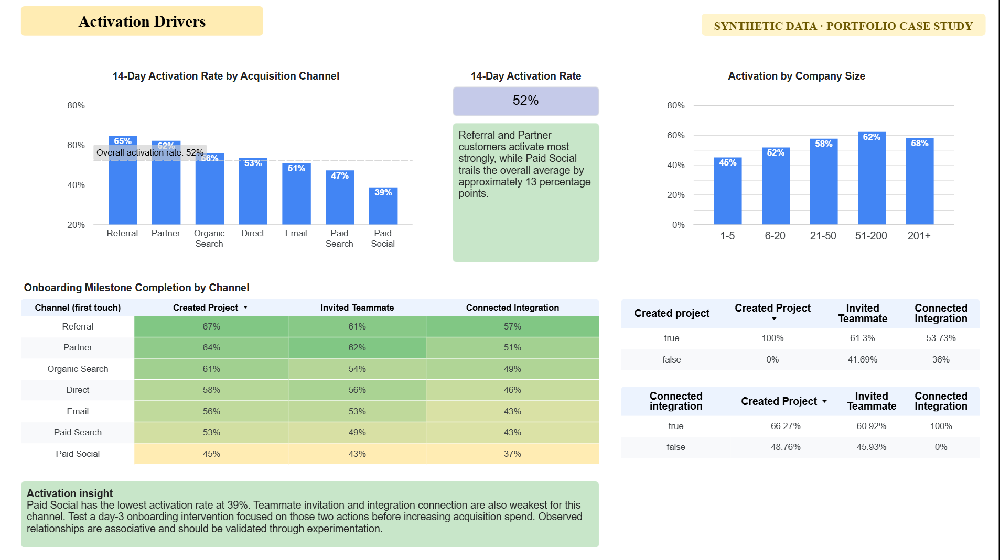
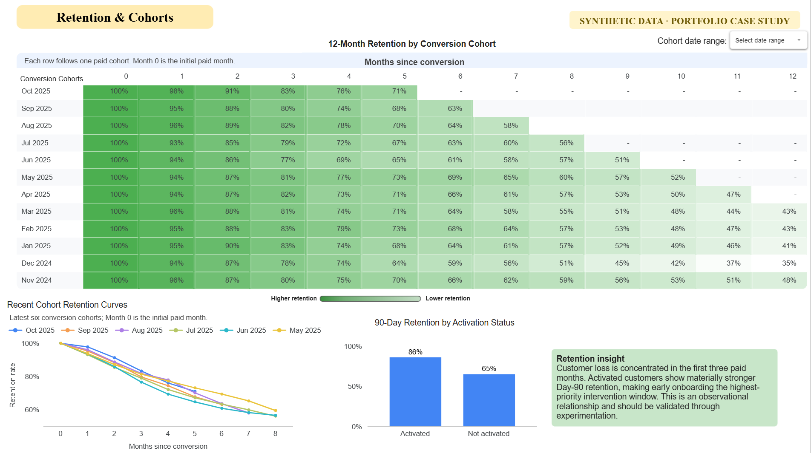
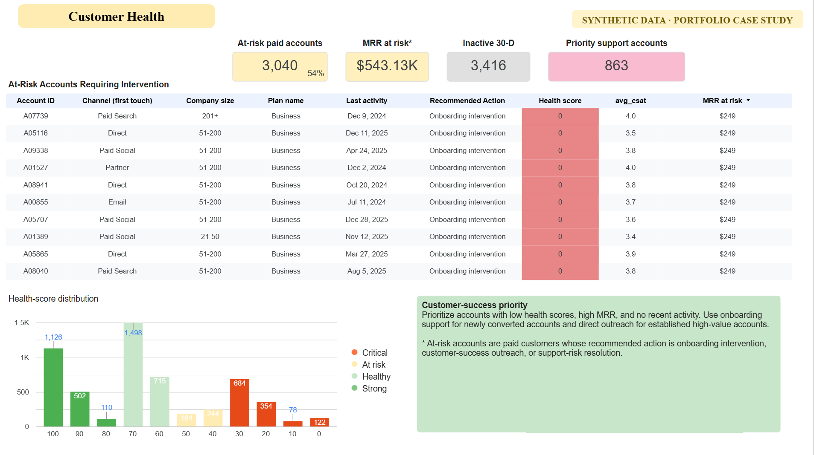
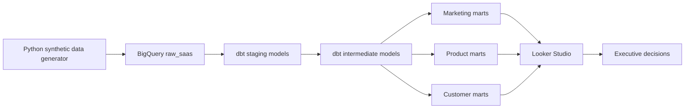
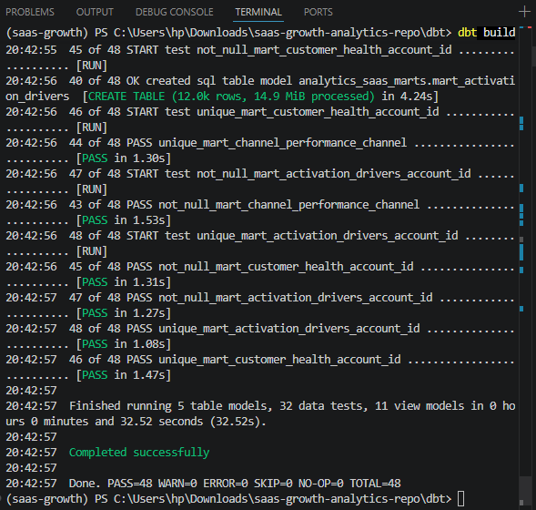

# SaaS Growth Analytics: From Acquisition to 90-Day Retention

> An end-to-end analytics engineering and decision-support case study built with **SQL, dbt, BigQuery, Python, and Looker Studio**.

[](#data-quality-and-testing)
[](data/data_dictionary.md)
[](#)




[View the interactive Looker Studio dashboard](https://datastudio.google.com/reporting/f50d48d6-bdc5-47f1-9397-a5ef6d657cf3)


## Executive question

**Which acquisition channels bring customers who activate, convert, and remain subscribed, and where should Marketing and Product invest next?**

This project connects marketing spend and acquisition journeys with onboarding behaviour, subscriptions, invoice revenue, support interactions, and customer retention.

The objective is to move growth decisions beyond signup volume and platform reported conversions toward activation, retained customers, and realized revenue.

## Executive answer

Customer quality (not signup volume alone) should guide acquisition and onboarding decisions.

* Overall 14-day activation is approximately **52%**.
* Referral has the strongest activation rate at approximately **65%**, while Paid Social has the weakest at approximately **39%**.
* Referral and Organic Search each generate approximately **$6.9 in observed realized revenue per $1 of attributed marketing spend**.
* Paid Social generates approximately **$0.4 per $1 of spend**, making it the clearest paid-channel optimization opportunity.
* Activated paid accounts show approximately **86% 90-day retention**, compared with approximately **65%** among non-activated paid accounts.
* Customer loss is concentrated in the first three paid months, making early onboarding the highest-priority intervention window.

***These results are observational. They identify where to test interventions but do not establish causal incrementality***.

## Recommended decisions

| Priority | Recommendation                                                                                                              | Business rationale                                                               | Validation                                                                                                                                 |
| -------- | --------------------------------------------------------------------------------------------------------------------------- | -------------------------------------------------------------------------------- | ------------------------------------------------------------------------------------------------------------------------------------------ |
| 1        | Trigger a day-3 onboarding intervention when a Paid Social trial has completed fewer than two critical actions.             | Paid Social has the weakest activation and revenue efficiency.                   | Randomized account-level holdout; primary metric: 14-day activation; guardrails: unsubscribe rate, support volume, and early cancellation. |
| 2        | Protect and expand high efficiency referral acquisition while testing improvements to Paid Social targeting and onboarding. | Referral combines strong activation, retention, and observed revenue efficiency. | Referral program experiment and Paid Social audience/onboarding holdouts.                                                                  |
| 3        | Make teammate invitation and integration connection explicit onboarding milestones.                                         | These actions represent collaborative adoption and deeper workflow integration.  | Test milestone prompts and measure activation, paid conversion, and 90-day retention.                                                      |
| 4        | Add retained CAC and 90-day revenue-to-spend to regular marketing reporting.                                                | Platform ROAS can overvalue campaigns that generate low-quality conversions.     | Monthly reconciliation across warehouse, CRM, billing, and advertising platforms.                                                          |

### Quantified planning scenario

A **10 percentage point** improvement in **Paid Social activation** is associated with approximately:

* **210 additional activated trials**
* **93 additional paid accounts**
* **81 additional 90-day retained accounts**
* **$96K in annualized recurring revenue**

***This is a planning scenario based on observed funnel relationships, not a causal forecast***.


### Experiment validation

The proposed hypothesis, treatment, eligibility criteria, metrics, guardrails, and rollout decision are documented in the [Paid Social onboarding experiment plan](docs/onboarding_experiment.md).

## What I built

* A reproducible synthetic B2B SaaS dataset covering acquisition, product events, subscriptions, invoices, and support interactions
* A BigQuery raw-data layer and tested dbt transformation pipeline
* Staging, intermediate, and decision-ready marketing, product, and customer marts
* Governed definitions for activation, paid conversion, CAC, retained CAC, realized revenue, retention, and customer health
* A five-page Looker Studio dashboard
* A quantified business recommendation and experiment plan

## Dashboard

The [interactive report](https://datastudio.google.com/reporting/f50d48d6-bdc5-47f1-9397-a5ef6d657cf3) contains five pages:

1. **Executive Overview**: lifecycle KPIs, funnel performance, channel revenue efficiency, and recommended action
2. **Acquisition & Unit Economics**: spend, CAC, retained CAC, customer quality, and channel comparisons
3. **Activation Drivers**: activation by channel and company size, plus onboarding milestone completion
4. **Retention & Cohorts**: cohort heatmap, retention curves, and activated versus non-activated retention
5. **Customer Health**: at-risk accounts, MRR at risk, inactivity, support risk, and intervention priorities

### Additional dashboard views

<details>
<summary>View Activation Drivers</summary>



</details>

<details>
<summary>View Retention & Cohorts</summary>



</details>

<details>
<summary>View Customer Health</summary>



</details>

## Architecture


```mermaid
flowchart LR
    A[Python synthetic data generator] --> B[BigQuery raw_saas]
    B --> C[dbt staging models]
    C --> D[dbt intermediate models]
    D --> E[Marketing marts]
    D --> F[Product marts]
    D --> G[Customer marts]
    E --> H[Looker Studio]
    F --> H
    G --> H
    H --> I[Executive decisions]
```

## Metric definitions

| Metric | Definition |
|---|---|
| Activation | Account completes at least two of three critical actions: create a project, invite a teammate, or connect an integration—within 14 days of signup. |
| Trial-to-paid conversion | Share of trial accounts with a non-null conversion date. |
| 90-day retention | Paid account has no cancellation on or before 90 days after conversion. |
| CAC | Channel spend divided by new paid accounts attributed to that channel. |
| Retained CAC | Channel spend divided by paid accounts retained at day 90. |
| Revenue-to-spend | Realized invoice revenue divided by channel spend during the synthetic observation period ending March 31, 2026. |
| Customer health | Weighted score based on activation, recent product activity, high-priority support tickets, and customer satisfaction. |


## Repository map

```text
.
├── assets/                      # Portfolio images and dashboard wireframe
├── data/
│   ├── raw/                     # Reproducible synthetic source tables
│   ├── sample/                  # Small samples for quick inspection
│   └── data_dictionary.md
├── dbt/
│   ├── models/staging/          # Renaming, typing, source cleanup
│   ├── models/intermediate/     # Activation, attribution, revenue, retention
│   └── models/marts/            # Decision-ready marketing/product/customer tables
├── docs/
│   ├── executive_brief.md
│   ├── dashboard_build_guide.md
│   ├── measurement_plan.md
│   ├── onboarding_experiment.md
│   └── opportunity_scenario.md
├── scripts/
│   ├── generate_synthetic_data.py
│   └── load_csv_to_bigquery.py
├── sql/
│   ├── analysis/                # Hiring-manager-friendly business analyses
│   └── quality_checks/          # Reconciliation and QA queries
└── .github/workflows/           # Automated SQL/dbt checks
```

## Run the project

### 1. Generate the data

```bash
python -m venv .venv
# Windows: .venv\Scripts\activate
# macOS/Linux: source .venv/bin/activate
pip install -r requirements.txt
python scripts/generate_synthetic_data.py
```

### 2. Load raw CSV files to BigQuery

Create a Google Cloud project and a BigQuery dataset named `raw_saas`, authenticate locally, then run:

```bash
python scripts/load_csv_to_bigquery.py --project YOUR_GCP_PROJECT --dataset raw_saas
```

### 3. Configure and run dbt

**Windows PowerShell**

```powershell
New-Item -ItemType Directory -Force "$HOME\.dbt"
Copy-Item ".\profiles.example.yml" "$HOME\.dbt\profiles.yml"
dbt debug
dbt build
```
**macOS/Linux**
```bash
mkdir -p ~/.dbt
cp profiles.example.yml ~/.dbt/profiles.yml
dbt debug
dbt build
```

### 4. Connect Looker Studio

Connect the report to the decision-ready tables in the `analytics_saas_marts` BigQuery dataset.

See [the dashboard build guide](docs/dashboard_build_guide.md) for chart definitions, filters, and metric configuration.


## Data quality and testing

The dbt project tests:

- Primary-key uniqueness and non-nullness
- Valid channel, event, plan, and status values
- Account relationships across event, subscription, invoice, and support tables
- One row per account in customer marts
- Logical dates, including conversion after signup and cancellation after conversion
- Reconciliation between invoice revenue and channel revenue marts

Run all models and tests with:

```bash
dbt build
```
The dbt project was successfully built and tested in BigQuery. The build validates model dependencies, source relationships, uniqueness, non-null constraints, and accepted values.




## Limitations

- Data is synthetic and designed to demonstrate analytical reasoning, not reproduce a real company.
- Revenue-to-spend is observational and should not be interpreted as causal incrementality.
- First-touch attribution simplifies multi-touch journeys; the repository includes a multi-touch comparison query for transparency.
- The annualized scenario assumes observed activation differences would partially transfer under intervention. A randomized experiment is required before financial commitment.

## What this project demonstrates

- Advanced SQL and dimensional modelling
- dbt transformations, documentation, tests, and lineage
- Marketing funnel, attribution, CAC, retention, and LTV analysis
- Product activation and customer-health analytics
- Experiment design and quantified recommendations
- Executive communication that separates evidence, assumptions, and decisions

## My contribution

I framed the business problem, generated the reproducible synthetic data, loaded it into BigQuery, built and tested the dbt transformation pipeline, defined the analytical metrics, created the Looker Studio dashboard, and translated the findings into an experiment and investment recommendation.

## Future enhancements

- Add business-friendly customer health bands and calibrated risk thresholds
- Add milestone-level 90-day retention comparisons
- Add monthly channel-performance trends
- Add experiment-results models and incremental-lift reporting

## Author

**Miaad Nabizadeh** | Marketing Analytics | Customer Insights | Product Analytics  
[LinkedIn](https://www.linkedin.com/in/miaadnabizadeh)
