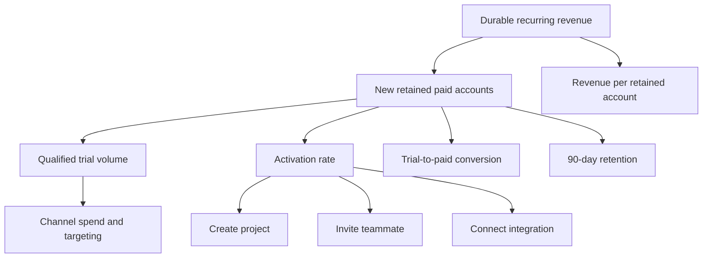

# Measurement Plan

## Objective

Increase durable subscription growth by connecting marketing acquisition to activation, conversion, retention, and realized revenue.

## KPI tree

## Metric ownership

| Metric | Owner | Source of truth | Refresh | Decision supported |
|---|---|---|---|---|
| Signups | Growth Marketing | `fct_growth_funnel` | Daily | Channel volume |
| Activation | Product Growth | `int_account_activation` | Daily | Onboarding optimization |
| Trial conversion | Revenue Operations | `subscriptions` | Daily | Funnel performance |
| 90-day retention | Customer Analytics | `int_account_retention` | Weekly | Customer quality |
| CAC and retained CAC | Marketing Analytics | `mart_channel_performance` | Weekly | Budget allocation |
| Customer health | Customer Success | `mart_customer_health` | Daily | Intervention prioritization |

## Experiment proposal

**Hypothesis:** A day-3 onboarding intervention focused on teammate invitation and integration connection will increase 14-day activation among under-activated trials.

- Population: Paid Social and Paid Search trials with fewer than two critical actions by day 3.
- Randomization unit: Account.
- Treatment: In-app checklist plus lifecycle email.
- Control: Existing onboarding.
- Primary metric: 14-day activation.
- Secondary metrics: trial-to-paid conversion, time-to-activation.
- Guardrails: unsubscribe rate, support tickets per account, cancellation within 30 days.
- Decision rule: Roll out only when the confidence interval excludes a commercially insignificant uplift and guardrails remain within agreed thresholds.
